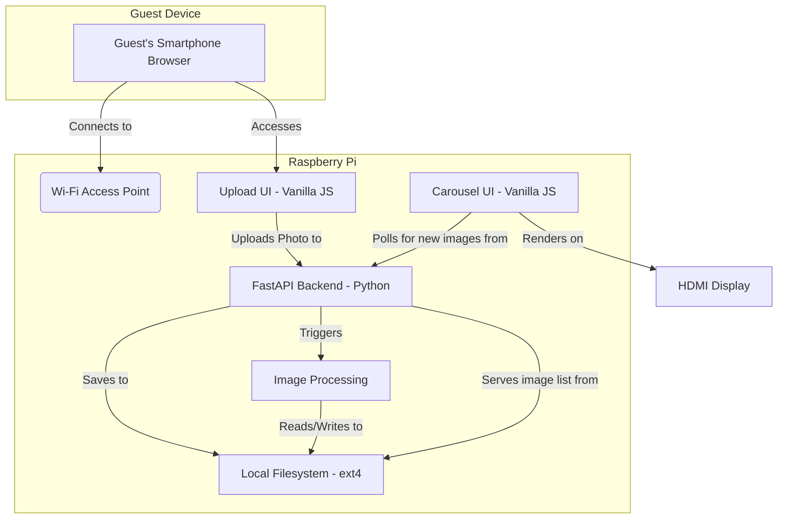
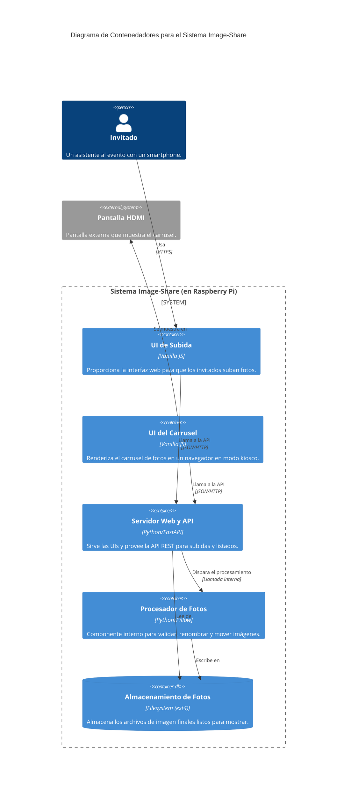
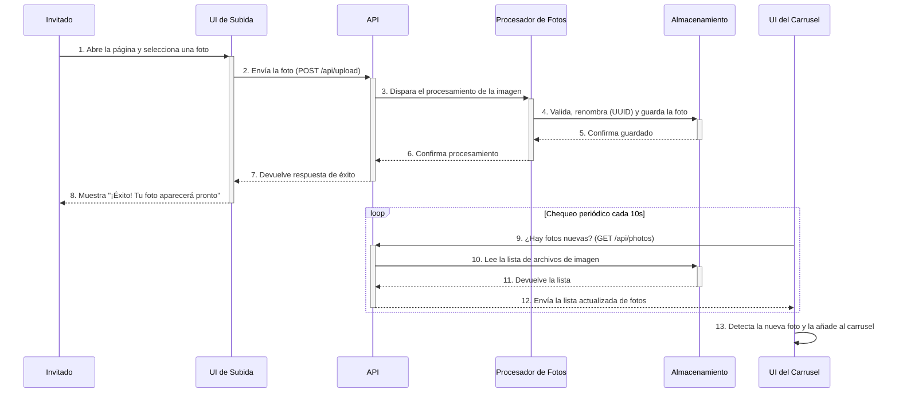
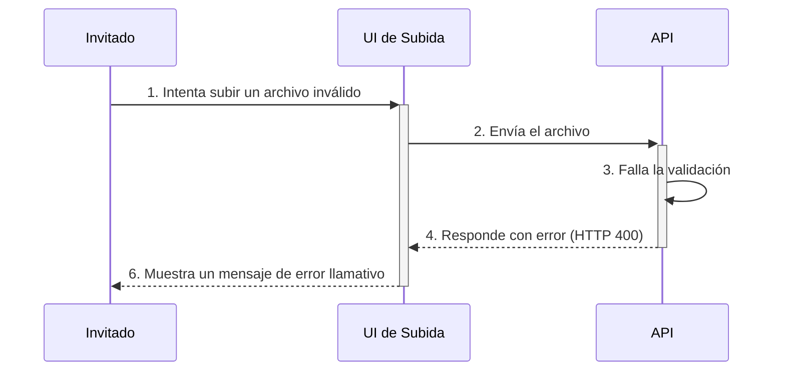

# Image-Share Fullstack Architecture Document

## Section 1: Introduction

This document outlines the complete fullstack architecture for the Image-Share project, including backend systems, frontend implementation, and their integration. It serves as the single source of truth for AI-driven development, ensuring consistency across the entire technology stack.

This unified approach combines what would traditionally be separate backend and frontend architecture documents, streamlining the development process for modern fullstack applications where these concerns are increasingly intertwined.

### Section 1.1: Starter Template or Existing Project
N/A - Greenfield project.

### Section 1.2: Change Log
| Date | Version | Description | Author |
| :--- | :--- | :--- | :--- |
| 2025-10-13 | 1.0 | Initial draft of the architecture document. | Winston (Architect) |
| 2025-10-13 | 1.1 | Added encryption requirement for backups and a new Accessibility section based on checklist feedback. | Winston (Architect) |

---
## Section 2: High Level Architecture

#### **Technical Summary**
This architecture outlines a self-contained, offline-first monolithic system designed for a Raspberry Pi 4B. The backend will be a Python/FastAPI application responsible for serving the UI, handling photo uploads, and processing images. The frontend consists of two distinct, lightweight vanilla JavaScript applications: a mobile-first upload interface for guests and a kiosk-mode carousel display for the main screen. All data is stored on the local filesystem, reinforcing the system's zero-dependency, plug-and-play design goal outlined in the PRD.

#### **Platform and Infrastructure Choice**
**Platform:** Custom/Bare-Metal on Raspberry Pi
**Key Services:** `hostapd` (Wi-Fi AP), `dnsmasq` (DHCP/DNS), `systemd` (Process Management), `Uvicorn` (Web Server), Local Filesystem (Storage)
**Deployment Host and Regions:** Single Raspberry Pi 4B device, deployed on-premise at event venues. No cloud regions apply.

#### **Repository Structure**
**Structure:** Monorepo
**Monorepo Tool:** N/A - Simple directory structure, no specialized tooling like Nx or Turborepo is needed for this scale.
**Package Organization:** The repository will be organized into top-level directories for `backend`, `upload-ui`, `carousel-ui`, and `scripts`, promoting a clear separation of concerns within the single repository.

#### **High Level Architecture Diagram**


#### **Architectural Patterns**
- **Monolithic Architecture:** A single backend process simplifies development, deployment, and management on the resource-constrained Raspberry Pi. _Rationale:_ Avoids the unnecessary complexity and overhead of microservices for a self-contained appliance.
- **Offline-First:** The system is designed to operate with zero internet connectivity. _Rationale:_ This is a core requirement from the PRD, ensuring functionality in any venue regardless of internet availability.
- **Filesystem as Database:** Photo metadata and state are managed directly on the filesystem instead of a traditional database. _Rationale:_ Reduces dependencies and simplifies the stack, which is adequate for the project's scale.
- **Polling for Real-Time Updates:** The carousel UI will poll the backend for changes. _Rationale:_ Simpler to implement and more robust than WebSockets on an embedded device, and sufficient for the 10-15 second update latency target.

---
## Section 3: Tech Stack

#### **Technology Stack Table**

| Category | Technology | Version | Purpose | Rationale |
| :--- | :--- | :--- | :--- | :--- |
| **Frontend Language** | JavaScript | ES2021+ | Core UI Logic | Universal browser compatibility, lightweight, and avoids complex build steps. |
| **Frontend Framework**| Vanilla JS | N/A | UI Application | Ensures the absolute minimum bundle size and fastest possible load time, which is critical for the mobile upload interface. |
| **UI Component Library**| None | N/A | UI Components | Custom, minimal CSS will be used. Avoids overhead of a library for a very simple UI. |
| **State Management** | Local Component State | N/A | Manage UI State | The application's state is simple enough that a dedicated library like Redux or Zustand is unnecessary overhead. |
| **Backend Language** | Python | 3.10+ | Server-side Logic | Mature, excellent for file system operations and system scripting, with a strong ecosystem for image processing. |
| **Backend Framework** | FastAPI | Latest | API & Web Server | Provides high performance for concurrent uploads (async) and automatic API documentation, as suggested in the PRD. |
| **API Style** | REST | OpenAPI 3.0 | Client-Server Communication | Simple, widely understood standard. FastAPI generates the OpenAPI specification automatically, aiding development. |
| **Database** | Filesystem | N/A | Data Persistence | A core architectural decision to reduce dependencies and complexity, sufficient for the project's scale. |
| **File Storage** | Local SSD | 500GB+ | Photo Storage | Provides fast and reliable storage for images, as required by the PRD. |
| **Authentication** | None | N/A | User Access Control | Core requirement for a zero-friction guest experience on an isolated, trusted network. |
| **Backend Testing** | pytest | Latest | Unit & Integration Tests | The standard, powerful testing framework for the Python ecosystem. |
| **E2E Testing** | Manual & Scripted | N/A | System Validation | Full automated E2E is too complex for the MVP. Critical paths will be validated via scripts and manual testing. |
| **IaC Tool** | Ansible / Shell Script | Latest | Pi Provisioning | Enables automated, repeatable setup of the Raspberry Pi devices from a clean OS install. |
| **Process Manager** | systemd | OS-provided | Service Management | Robust, built-in OS tool for ensuring the backend process runs on boot and restarts on failure. |
| **Monitoring** | journalctl | OS-provided | Log Aggregation | The standard systemd interface for viewing service logs on the device. |
| **Logging** | Python Logging Module | 3.10+ | Application Logging | Flexible standard library for structured logging to the systemd journal or local files. |
| **CSS Framework** | Custom CSS | N/A | Styling | Guarantees the smallest possible CSS payload for the fastest mobile experience. |

---
## Section 4: Data Models

#### **Photo Model**

**Purpose:**
Represents a single photo uploaded by a guest. This is the central data entity of the entire system. Its structure will be used in API responses and frontend state management.

**Key Attributes:**
-   `id: string` - The unique UUID of the photo, which also serves as its filename on the server.
-   `url: string` - The URL path to retrieve the full-resolution image for display in the carousel.
-   `createdAt: string` - The ISO 8601 timestamp indicating when the photo was processed. This is crucial for sorting the carousel chronologically.

#### **TypeScript Interface**
```typescript
interface Photo {
  id: string;
  url: string;
  createdAt: string;
}
```

#### **Relationships**
-   No direct relationships are defined in the MVP. Conceptually, a Photo "belongs to" an Event, but an Event is not a managed data entity within the system itself.

---
## Section 5: API Specification

#### **REST API Specification (OpenAPI 3.0)**
```yaml
openapi: 3.0.0
info:
  title: Image-Share API
  version: 1.0.0
  description: |-
    API para el sistema de agregación de fotos offline Image-Share.
    Esta es una API simple y sin autenticación que se ejecuta en una red local aislada.
servers:
  - url: http://10.0.17.1
    description: Servidor del dispositivo local
paths:
  /health:
    get:
      summary: Chequeo de Salud del Sistema
      description: Proporciona el estado operativo del servidor.
      responses:
        '200':
          description: El sistema está funcionando correctamente.
          content:
            application/json:
              schema:
                type: object
                properties:
                  status:
                    type: string
                    example: "ok"
                  timestamp:
                    type: string
                    format: date-time
  /api/photos:
    get:
      summary: Obtener Todas las Fotos
      description: Recupera una lista de todas las fotos procesadas, ordenadas cronológicamente.
      responses:
        '200':
          description: Una lista de objetos de Foto.
          content:
            application/json:
              schema:
                type: array
                items:
                  $ref: '#/components/schemas/Photo'
  /api/upload:
    post:
      summary: Subir una Foto
      description: Sube un archivo de foto para ser procesado y mostrado en el carrusel.
      requestBody:
        required: true
        content:
          multipart/form-data:
            schema:
              type: object
              properties:
                photo:
                  type: string
                  format: binary
                  description: "El archivo de foto a subir (formatos aceptados: JPEG, PNG, HEIC)."
      responses:
        '200':
          description: Foto subida con éxito.
        '400':
          description: Petición incorrecta (ej. formato de archivo inválido).
        '413':
          description: Archivo demasiado grande (límite de 25MB).
components:
  schemas:
    Photo:
      type: object
      description: Representa una sola foto procesada.
      properties:
        id:
          type: string
          description: El UUID único de la foto.
          example: "a3f2b8c1-9d4e-4f6a-8c2b-1e3d5f7a9b0c.jpg"
        url:
          type: string
          description: La ruta URL para acceder a la imagen.
          example: "/images/a3f2b8c1-9d4e-4f6a-8c2b-1e3d5f7a9b0c.jpg"
        createdAt:
          type: string
          format: date-time
          description: La fecha y hora en formato ISO 8601 de cuándo se procesó la foto.
```

---
## Section 6: Components

#### **Lista de Componentes**

**1. Guest Upload UI (Frontend)**
-   **Responsibility:** Proporcionar una interfaz web simple y optimizada para móviles que permita a los invitados seleccionar y subir sus fotos. Muestra mensajes de éxito o error.
-   **Key Interfaces:** Interactúa con el endpoint `POST /api/upload` de la API.
-   **Dependencies:** Image-Share API.
-   **Technology Stack:** Vanilla JavaScript, Custom CSS, HTML5.

**2. Carousel Display UI (Frontend)**
-   **Responsibility:** Mostrar las fotos procesadas en un carrusel a pantalla completa que avanza automáticamente. Muestra la pantalla de instrucciones cuando no hay fotos.
-   **Key Interfaces:** Interactúa con el endpoint `GET /api/photos` para obtener la lista de imágenes.
-   **Dependencies:** Image-Share API.
-   **Technology Stack:** Vanilla JavaScript, Custom CSS, HTML5.

**3. Image-Share API (Backend)**
-   **Responsibility:** Servir las dos interfaces de usuario (Upload y Carousel). Proporcionar los endpoints de la API para la subida y recuperación de fotos.
-   **Key Interfaces:** Expone la API REST (`/health`, `/api/upload`, `/api/photos`).
-   **Dependencies:** Photo Processor, Almacenamiento en Filesystem.
-   **Technology Stack:** Python, FastAPI, Uvicorn.

**4. Photo Processor (Backend)**
-   **Responsibility:** Procesar las imágenes recién subidas. Esto incluye validar el formato, generar un UUID como nuevo nombre y mover el archivo al directorio público.
-   **Key Interfaces:** Es un componente interno del backend, invocado por la API tras una subida exitosa. Interactúa directamente con el sistema de archivos.
-   **Dependencies:** Almacenamiento en Filesystem.
-   **Technology Stack:** Python, Pillow.

**Note on Platform Scope:** The networking components (`hostapd`, `dnsmasq`) are considered part of the pre-configured base platform and are not within the development scope of the components listed above.

#### **Diagrama de Componentes (Diagrama de Contenedores C4)**


---
## Section 7: External APIs

No se requieren integraciones con APIs externas para este proyecto.

**Rationale:**
Esta es una decisión de arquitectura fundamental impulsada por el requisito de "offline-first" (funcionar sin conexión) del PRD. El sistema está diseñado para ser completamente autónomo y operar sin ningún tipo de conectividad a Internet, lo que elimina la necesidad y la dependencia de servicios externos.

---
## Section 8: Core Workflows

#### **Flujo Principal: Subida de Foto por Invitado**



---
## Section 9: Database Schema

El "esquema" se define por la siguiente estructura de directorios dentro del sistema:

```plaintext
/image-share-data/
├── raw_images/
│   └── photo_from_guest.jpg  // Staging area for new uploads, pre-processing
│
├── display_images/
│   └── a3f2b8c1-9d4e-4f6a-8c2b-1e3d5f7a9b0c.jpg // Processed, public-facing images
│
└── failed_images/
    └── corrupted_image.png   // Images that failed processing are moved here
```

---
## Section 10: Frontend Architecture

#### **10.1 Component Architecture**

**Component Organization**
```text
/upload-ui/
├── index.html              # El punto de entrada HTML
├── js/
│   ├── app.js              # Lógica principal de la aplicación
│   └── components/         # Módulos de UI reutilizables (ej. Uploader.js)
│       └── Uploader.js
├── css/
│   └── style.css           # Estilos principales
└── assets/
    └── ...                 # Imágenes, iconos, etc.
```

**Component Template (Example)**
```typescript
// Fichero: /js/components/Uploader.js

export function Uploader(rootElement, api) {
  const fileInput = rootElement.querySelector('input[type="file"]');
  const submitButton = rootElement.querySelector('button');
  const statusMessage = rootElement.querySelector('.status');

  const handleSubmit = async (event) => {
    event.preventDefault();
    const file = fileInput.files[0];
    if (!file) return;

    submitButton.disabled = true;
    statusMessage.textContent = 'Subiendo...';

    try {
      await api.uploadPhoto(file);
      statusMessage.textContent = '¡Éxito!';
    } catch (error) {
      statusMessage.textContent = `Error: ${error.message}`;
    } finally {
      submitButton.disabled = false;
    }
  };

  submitButton.addEventListener('click', handleSubmit);
}
```

#### **10.2 State Management Architecture**

**State Structure**
```typescript
// Fichero: /carousel-ui/js/app.js

let photos = []; 
let currentIndex = 0;
let isLoading = true; 
let error = null; 

function setPhotos(newPhotos) {
  photos = newPhotos;
  isLoading = false;
  render();
}
```

**State Management Patterns**
-   **Estado Local del Módulo:** El estado se encapsula dentro del archivo/módulo de JavaScript que lo necesita.
-   **Flujo de Datos Unidireccional (Simplificado):** Las acciones del usuario o las respuestas de la API llaman a funciones que actualizan las variables de estado.
-   **El Estado como "Fuente de la Verdad":** La UI es siempre un reflejo del estado actual contenido en las variables.

#### **10.3 Routing Architecture**

**Route Organization**
```text
El enrutamiento es manejado por el servidor backend:

- / (ruta raíz): Sirve el archivo `index.html` de la UI de Subida (`upload-ui`).

- /display: Sirve el archivo `index.html` de la UI del Carrusel (`carousel-ui`).
```

**Protected Route Pattern**
```typescript
// No aplicable.
```

#### **10.4 Frontend Services Layer**

**API Client Setup**
```typescript
// Fichero: /js/services/api.js

const BASE_URL = ''; 

export const ApiService = {
  async getPhotos() {
    const response = await fetch(`${BASE_URL}/api/photos`);
    if (!response.ok) {
      throw new Error('No se pudo obtener la lista de fotos.');
    }
    return response.json();
  },

  async uploadPhoto(photoFile) {
    const formData = new FormData();
    formData.append('photo', photoFile);

    const response = await fetch(`${BASE_URL}/api/upload`, {
      method: 'POST',
      body: formData,
    });

    if (!response.ok) {
      const errorData = await response.json().catch(() => ({ detail: 'Error desconocido' }));
      throw new Error(errorData.detail || 'Error al subir la foto.');
    }
    return response.json();
  },
};
```

---
## Section 11: Backend Architecture

#### **11.1 Service Architecture**

**Controller/Route Organization**
```text
/backend/
├── main.py
├── api/
│   ├── photos.py
│   └── upload.py
├── core/
│   ├── processor.py
│   ├── models.py
│   └── repository.py
└── static/
```

**Controller Template (Example)**
```python
# Fichero: /backend/api/photos.py

from fastapi import APIRouter, HTTPException
from typing import List
from ..core.models import Photo

router = APIRouter()
PHOTO_DIR = "/image-share-data/display_images/"

@router.get("/api/photos", response_model=List[Photo], tags=["Photos"])
async def get_all_photos():
    # ... (lógica para leer archivos y devolver la lista)
    pass
```

#### **11.2 Database Architecture**

**Schema Design**
```text
// No se usa SQL. El "esquema" es la estructura de directorios.
/image-share-data/
├── display_images/
├── raw_images/
└── failed_images/
```

**Data Access Layer (Repository Pattern)**
```python
# Fichero: /backend/core/repository.py

class PhotoRepository:
    def get_all_sorted_by_date(self) -> List[Photo]:
        # ... (lógica para abstraer el acceso al filesystem)
        pass

photo_repository = PhotoRepository()
```

#### **11.3 Authentication and Authorization**

**Auth Flow**
```mermaid
%% No aplicable.
```

**Middleware/Guards**
```python
# No aplicable.
```

---
## Section 12: Unified Project Structure

```plaintext
image-share/
├── .github/
│   └── workflows/
├── apps/
│   ├── upload-ui/
│   ├── carousel-ui/
│   └── api/
├── infrastructure/
│   └── provision.yml
├── scripts/
│   └── extract-photos.sh
├── docs/
│   ├── prd.md
│   └── architecture.md
├── .gitignore
└── README.md
```

---
## Section 13: Development Workflow

#### **13.1 Local Development Setup (Corregido con `uv`)**

**Prerequisites**
```bash
# 1. uv
uv --version
# 2. Ansible (Opcional)
ansible --version
```

**Initial Setup**
```bash
# 1. Clonar repo y navegar a apps/api
# 2. Crear entorno virtual
uv venv
# 3. Activar entorno
source .venv/bin/activate
# 4. Instalar dependencias
uv pip install -r requirements.txt
```

**Development Commands**
```bash
# Iniciar servidor de desarrollo
uvicorn apps.api.main:app --reload
# Ejecutar pruebas
pytest
```

#### **13.2 Environment Configuration**

**Required Environment Variables**
```bash
# ---
# --- Backend (.env en apps/api) ---
LOG_LEVEL="INFO"
PHOTO_DIR_DISPLAY="/image-share-data/display_images"
PHOTO_DIR_RAW="/image-share-data/raw_images"
PHOTO_DIR_FAILED="/image-share-data/failed_images"
```

---
## Section 14: Deployment Architecture

#### **14.1 Deployment Strategy**

**Frontend Deployment:**
-   **Platform:** N/A (Servido por el backend).
-   **Build Command:** N/A.
-   **Output Directory:** `apps/api/static/`

**Backend Deployment:**
-   **Platform:** Raspberry Pi OS Lite (64-bit).
-   **Build Command:** N/A.
-   **Deployment Method:** `git clone`, `uv pip install`, y activación de `systemd`.

#### **14.2 CI/CD Pipeline**

```yaml
# Fichero: .github/workflows/ci.yaml
name: Continuous Integration
on: [push, pull_request]
jobs:
  test-and-lint:
    runs-on: ubuntu-latest
    defaults:
      run:
        working-directory: ./apps/api
    steps:
    - uses: actions/checkout@v4
    - uses: astral-sh/setup-uv@v1
      with:
        uv-version: latest
    - name: Install Dependencies
      run: uv pip install -r requirements.txt
    - name: Lint with Ruff
      run: uv run ruff check ../..
    - name: Run Backend Tests
      run: uv run pytest
```

#### **14.3 Environments**

| Environment | Frontend URL | Backend URL | Purpose |
| :--- | :--- | :--- | :--- |
| **Development** | `http://localhost:8000/` | `http://localhost:8000/` | Desarrollo y pruebas en la máquina local. |
| **Staging** | `http://10.0.17.1/` | `http://10.0.17.1/` | Un Raspberry Pi dedicado para pruebas de aceptación. |
| **Production** | `http://10.0.17.1/` | `http://10.0.17.1/` | Dispositivos desplegados en los eventos. |

---
## Section 15: Security and Performance

#### **15.1 Security Requirements**

**Frontend Security:**
-   **CSP Headers:** `default-src 'self'`
-   **XSS Prevention:** No se renderiza contenido de usuario como HTML.
-   **Secure Storage:** N/A.

**Backend Security:**
-   **Input Validation:** Estricta validación de tipo y tamaño de archivo.
-   **Rate Limiting:** N/A para MVP.
-   **CORS Policy:** N/A para despliegue same-origin.

**Authentication Security:** N/A.

#### **15.2 Performance Optimization (Corregido)**

**Frontend Performance:**
-   **Bundle Size Target:** `< 50KB (JS + CSS)`
-   **Loading Strategy:** Carga mínima con scripts `defer`.
-   **Caching Strategy:** Cabeceras de cache HTTP estándar.

**Backend Performance:**
-   **Response Time Target:** Latencia total (subida a carrusel) de **≤ 10 segundos**.
-   **Database Optimization:** N/A (Filesystem). La estrategia de acceso a datos se define en la sección de Arquitectura de Base de Datos, donde se especifica que el script `extract-photos.sh` **debe encriptar el archivo ZIP de salida con una contraseña** para proteger la privacidad de los invitados.
-   **Caching Strategy:** Cache en memoria por 5 segundos para `GET /api/photos`.

---
## Section 16: Testing Strategy

#### **16.1 Testing Pyramid**

```text
           /\
          /  \
         /----
        /      \  <-- Pruebas de Integración (API)
       /--------\
      /          \ <-- Pruebas Unitarias
     /____________\ 
```

#### **16.2 Test Organization**

**Frontend Tests:** Principalmente manuales para el MVP.
**Backend Tests:** En el directorio `/apps/api/tests/`.
**E2E Tests:** Checklists manuales y scripts en `/scripts/`.

#### **16.3 Test Examples**

**Backend API Test (Real)**
```python
# Fichero: /apps/api/tests/test_main.py
from fastapi.testclient import TestClient
from ..main import app
client = TestClient(app)
def test_health_check_endpoint():
    response = client.get("/health")
    assert response.status_code == 200
    assert response.json()["status"] == "ok"
```

**E2E Test (Manual Checklist)**
```text
# ---
# --- Caso de Prueba E2E (Manual) ---
Feature: Subida de foto exitosa de extremo a extremo.
Pasos:
1. Conectarse a la red Wi-Fi.
2. Navegar a la IP del dispositivo.
3. Subir una imagen.
4. VERIFICAR: Mensaje de éxito en el móvil.
5. VERIFICAR: La foto aparece en el carrusel en menos de 10 segundos.
```

---
## Section 17: Coding Standards

#### **17.1 Critical Fullstack Rules**
-   Variables de Entorno Centralizadas.
-   Abstracción del Acceso a Datos (usar Repositorio).
-   Abstracción de Llamadas a la API (usar `ApiService`).
-   No Hardcodear Rutas.
-   Manejo de Errores Estándar.

#### **17.2 Naming Conventions**

| Elemento | Frontend (JS/CSS) | Backend (Python) | Ejemplo |
| :--- | :--- | :--- | :--- |
| **Variables/Funciones** | `camelCase` | `snake_case` | `getPhotos()`, `get_all_photos()` |
| **Clases/Módulos** | `PascalCase` | `PascalCase` | `ApiService.js`, `PhotoRepository` |
| **Nombres de Archivo** | `PascalCase.js` | `snake_case.py` | `Uploader.js`, `photo_repository.py` |
| **Clases de CSS** | `kebab-case` | N/A | `.main-container` |
| **Endpoints de API** | N/A | `snake_case` | `/api/photos` |

---
## Section 18: Error Handling Strategy

#### **18.1 Error Flow**


#### **18.2 Error Response Format**
```typescript
// Formato de error de FastAPI: { "detail": "Mensaje de error" }
interface ApiError {
  detail: string;
}
```

#### **18.3 Frontend Error Handling**
```typescript
// Se usarán clases de CSS y la API de vibración para hacer el error inconfundible.
// .error-visible { background-color: red; }
// .error-shake { animation: shake 0.8s; }
if (navigator.vibrate) { navigator.vibrate(200); }
```

#### **18.4 Backend Error Handling**
```python
# Se usarán manejadores de excepciones globales en FastAPI.
@app.exception_handler(Exception)
async def generic_exception_handler(request: Request, exc: Exception):
    # Log del error y respuesta JSON con código 500.
    return JSONResponse(status_code=500, content={"detail": "Error interno."})
```

---
## Section 19: Monitoring and Observability

#### **19.1 Monitoring Stack (Actualizado)**
-   **Backend Monitoring:** `systemd` y `journalctl`.
-   **Error Tracking:** Archivos de log locales.
-   **Performance Monitoring:** Manual y basado en logs.
-   **Depuración Avanzada:** Se puede usar `chrome://net-export` para problemas de red complejos.

#### **19.2 Key Metrics**
-   **Frontend:** Tiempos de respuesta de la API, Errores de JavaScript (en consola).
-   **Backend (en logs):** Tasa de Errores, Latencia de la API, Tiempo de Procesamiento de Imagen, Uso de Disco.

---
## Section 20: Checklist Results Report (FINAL)

**Status: PASS**

El análisis inicial reveló dos brechas en la Seguridad de Datos (encripción de backups) y Accesibilidad. Estos problemas han sido solucionados actualizando la sección de Arquitectura de Datos para exigir la encripción y añadiendo una nueva "Sección 21: Implementación de Accesibilidad" con guías específicas.

Con estos cambios, el documento de arquitectura se considera ahora completo y robusto, pasando todos los puntos del checklist.

---
## Section 21: Accessibility Implementation

Para cumplir con el requisito de WCAG 2.1 Nivel AA del PRD, el frontend `upload-ui` debe adherirse a los siguientes principios:

-   **HTML Semántico:** Usar elementos nativos de HTML para su propósito previsto (`<button>`, `<label>`, `<input>`). No usar `<div>` con manejadores de eventos para simular botones.
-   **Atributos ARIA:** Usar roles y propiedades de ARIA (Accessible Rich Internet Applications) donde sea necesario. Por ejemplo, el área de mensajes de estado debe usar `aria-live="polite"` para que los lectores de pantalla anuncien los mensajes de éxito o error automáticamente.
-   **Navegación por Teclado:** Todos los elementos interactivos deben ser alcanzables y operables usando la tecla `Tab` para la navegación y las teclas `Enter`/`Espacio` para la activación. El orden del foco debe ser lógico.
-   **Gestión del Foco:** Asegurar que el foco se gestione correctamente. Por ejemplo, si aparece un mensaje de error, el foco debe moverse programáticamente hacia él para que un usuario de lector de pantalla sea consciente del mismo.
-   **Contraste de Color:** Todo el texto y los elementos de la UI deben tener una relación de contraste de al menos 4.5:1 con su fondo, como especifican las directrices de WCAG AA.

```
