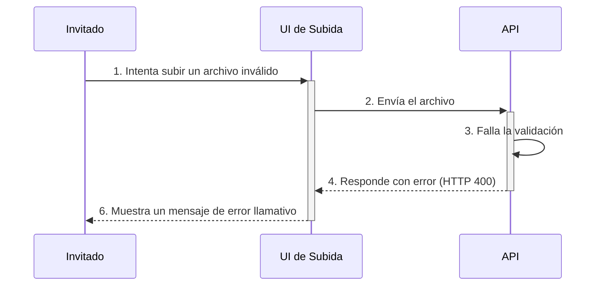

# Section 18: Error Handling Strategy

### **18.1 Error Flow**


### **18.2 Error Response Format**
```typescript
// Formato de error de FastAPI: { "detail": "Mensaje de error" }
interface ApiError {
  detail: string;
}
```

### **18.3 Frontend Error Handling**
```typescript
// Se usarán clases de CSS y la API de vibración para hacer el error inconfundible.
// .error-visible { background-color: red; }
// .error-shake { animation: shake 0.8s; }
if (navigator.vibrate) { navigator.vibrate(200); }
```

### **18.4 Backend Error Handling**
```python
# Se usarán manejadores de excepciones globales en FastAPI.
@app.exception_handler(Exception)
async def generic_exception_handler(request: Request, exc: Exception):
    # Log del error y respuesta JSON con código 500.
    return JSONResponse(status_code=500, content={"detail": "Error interno."})
```

---