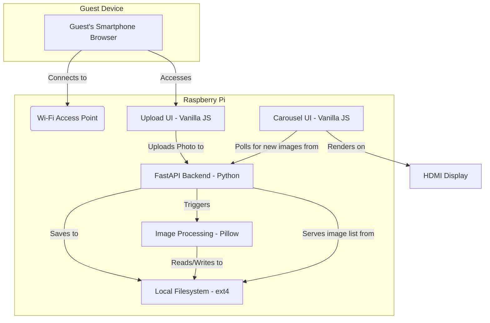

# Section 2: High Level Architecture

### **Technical Summary**
This architecture outlines a self-contained, offline-first monolithic system designed for a Raspberry Pi 4B. The backend will be a Python/FastAPI application responsible for serving the UI, handling photo uploads, and processing images. The frontend consists of two distinct, lightweight vanilla JavaScript applications: a mobile-first upload interface for guests and a kiosk-mode carousel display for the main screen. All data is stored on the local filesystem, reinforcing the system's zero-dependency, plug-and-play design goal outlined in the PRD.

### **Platform and Infrastructure Choice**
**Platform:** Custom/Bare-Metal on Raspberry Pi
**Key Services:** `hostapd` (Wi-Fi AP), `dnsmasq` (DHCP/DNS), `systemd` (Process Management), `Uvicorn` (Web Server), Local Filesystem (Storage)
**Deployment Host and Regions:** Single Raspberry Pi 4B device, deployed on-premise at event venues. No cloud regions apply.

### **Repository Structure**
**Structure:** Monorepo
**Monorepo Tool:** N/A - Simple directory structure, no specialized tooling like Nx or Turborepo is needed for this scale.
**Package Organization:** The repository will be organized into top-level directories for `backend`, `upload-ui`, `carousel-ui`, and `scripts`, promoting a clear separation of concerns within the single repository.

### **High Level Architecture Diagram**

### **Architectural Patterns**
- **Monolithic Architecture:** A single backend process simplifies development, deployment, and management on the resource-constrained Raspberry Pi. _Rationale:_ Avoids the unnecessary complexity and overhead of microservices for a self-contained appliance.
- **Offline-First:** The system is designed to operate with zero internet connectivity. _Rationale:_ This is a core requirement from the PRD, ensuring functionality in any venue regardless of internet availability.
- **Filesystem as Database:** Photo metadata and state are managed directly on the filesystem instead of a traditional database. _Rationale:_ Reduces dependencies and simplifies the stack, which is adequate for the project's scale.
- **Polling for Real-Time Updates:** The carousel UI will poll the backend for changes. _Rationale:_ Simpler to implement and more robust than WebSockets on an embedded device, and sufficient for the 10-15 second update latency target.

---