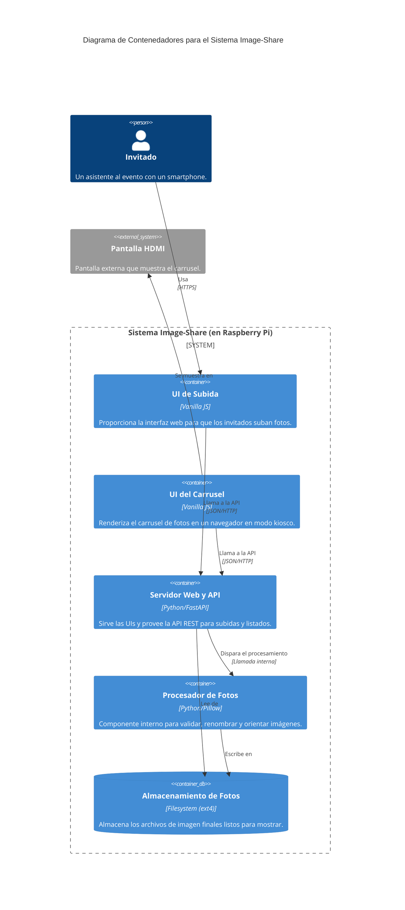

# Section 6: Components

### **Lista de Componentes**

**1. Guest Upload UI (Frontend)**
-   **Responsibility:** Proporcionar una interfaz web simple y optimizada para móviles que permita a los invitados seleccionar y subir sus fotos. Muestra mensajes de éxito o error.
-   **Key Interfaces:** Interactúa con el endpoint `POST /api/upload` de la API.
-   **Dependencies:** Image-Share API.
-   **Technology Stack:** Vanilla JavaScript, Custom CSS, HTML5.

**2. Carousel Display UI (Frontend)**
-   **Responsibility:** Mostrar las fotos procesadas en un carrusel a pantalla completa que avanza automáticamente. Muestra la pantalla de instrucciones cuando no hay fotos.
-   **Key Interfaces:** Interactúa con el endpoint `GET /api/photos` para obtener la lista de imágenes.
-   **Dependencies:** Image-Share API.
-   **Technology Stack:** Vanilla JavaScript, Custom CSS, HTML5.

**3. Image-Share API (Backend)**
-   **Responsibility:** Servir las dos interfaces de usuario (Upload y Carousel). Proporcionar los endpoints de la API para la subida y recuperación de fotos.
-   **Key Interfaces:** Expone la API REST (`/health`, `/api/upload`, `/api/photos`).
-   **Dependencies:** Photo Processor, Almacenamiento en Filesystem.
-   **Technology Stack:** Python, FastAPI, Uvicorn.

**4. Photo Processor (Backend)**
-   **Responsibility:** Procesar las imágenes recién subidas. Esto incluye validar el formato, corregir la orientación (EXIF), generar un UUID como nuevo nombre y mover el archivo al directorio público.
-   **Key Interfaces:** Es un componente interno del backend, invocado por la API tras una subida exitosa. Interactúa directamente con el sistema de archivos.
-   **Dependencies:** Almacenamiento en Filesystem.
-   **Technology Stack:** Python, Pillow.

### **Diagrama de Componentes (Diagrama de Contenedores C4)**

---