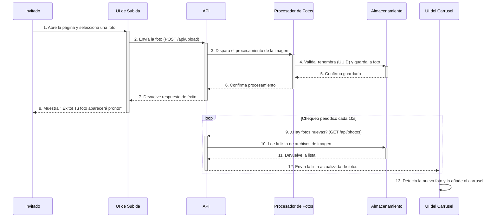

# Section 8: Core Workflows

### **Flujo Principal: Subida de Foto por Invitado**

```mermaid
sequenceDiagram
    participant Guest as Invitado
    participant UploadUI as UI de Subida
    participant API
    participant Processor as Procesador de Fotos
    participant Filesystem as Almacenamiento
    participant CarouselUI as UI del Carrusel

    Guest->>+UploadUI: 1. Abre la página y selecciona una foto
    UploadUI->>+API: 2. Envía la foto (POST /api/upload)
    API->>+Processor: 3. Dispara el procesamiento de la imagen
    Processor->>+Filesystem: 4. Valida, renombra (UUID) y guarda la foto
    Filesystem-->>-Processor: 5. Confirma guardado
    Processor-->>-API: 6. Confirma procesamiento
    API-->>-UploadUI: 7. Devuelve respuesta de éxito
    UploadUI-->>-Guest: 8. Muestra "¡Éxito! Tu foto aparecerá pronto"

    loop Chequeo periódico cada 10s
        CarouselUI->>+API: 9. ¿Hay fotos nuevas? (GET /api/photos)
        API->>+Filesystem: 10. Lee la lista de archivos de imagen
        Filesystem-->>-API: 11. Devuelve la lista
        API-->>-CarouselUI: 12. Envía la lista actualizada de fotos
    end
    CarouselUI->>CarouselUI: 13. Detecta la nueva foto y la añade al carrusel
```

---